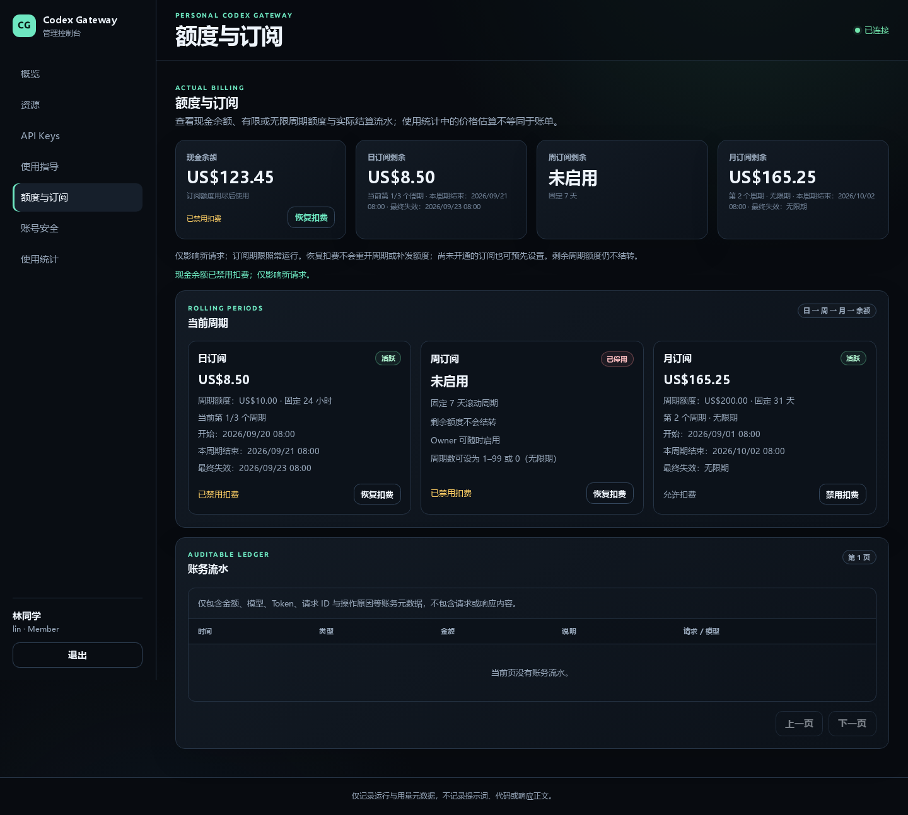
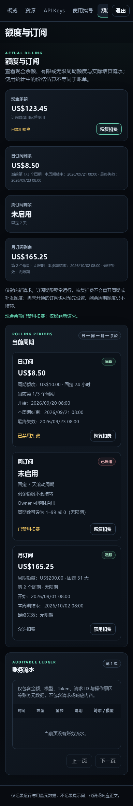

# 用户扣费来源设置验证

“额度与订阅”新增日、周、月订阅和现金余额的本人扣费开关。默认全部允许扣费，
Owner 查看他人时只读。设置与订阅有效状态分开持久保存，只影响新请求准入。

## 自动回归

- 接口：登录、同源、近期验证、严格布尔请求体、来源白名单、拒绝指定他人、
  Member/Owner 本人操作、重复明确赋值、保存失败和完整状态字段。
- PostgreSQL：新旧账户迁移默认值、全部 16 种禁用组合、恢复、扣费顺序和重试时间、
  续期到期、恢复不补发、充值重开保留设置、审计失败原子回滚和无金额流水。
- 并发：通过数据库锁等待链验证开关更新和请求准入的两种先后顺序；已受理请求
  继续按原来源结算，后来恢复的来源不会追加给旧请求。内部零价规则保持不变。
- 前端：本人操作、他人只读、加载/保存期间禁止操作、失败后重新读取服务器状态、
  重复点击，以及切换查看用户、退出或切换身份后的过期响应。

验证使用 Go 1.24.6、Node.js 和 `/tmp` 中独立的 PostgreSQL 16.15，数据库仅通过
私有 Unix socket 访问。未连接业务数据库。

```sh
go build -o /tmp/billing-source-tools/gateway ./cmd/gateway
go test -count=1 ./...
go test -race -count=1 ./internal/server ./internal/store
go vet ./...
go test -count=1 -tags=integration ./internal/store
go test -race -count=1 -tags=integration ./internal/store \
  -run '^TestBillingSourcePreferencesPostgresIntegration$'
```

数据库命令需要将 `TEST_DATABASE_URL` 指向新建的一次性测试库。竞态检查需要 C
编译器。上述检查均已通过；前端新增 44 项 Node 回归由 `go test` 自动调用。

## 页面检查

桌面与移动端使用本地静态资源和模拟接口验证，不调用真实上游或修改真实账务。
可在安装 Playwright、Chromium 和中文字体后运行
`node internal/server/testdata/billing_sources_browser.cjs` 复查交互并重新生成截图；
Playwright 装在仓库外时，用 `PLAYWRIGHT_MODULE` 指定其模块路径。
Chromium 153.0.8010.12 完成 8 次模拟来源写操作，桌面 1440×1080、移动端
390×844 均无页面脚本错误或横向溢出。




