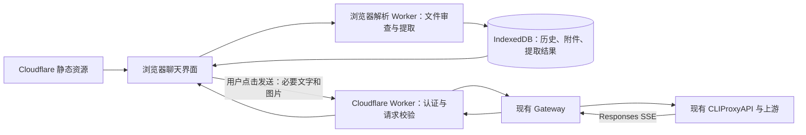
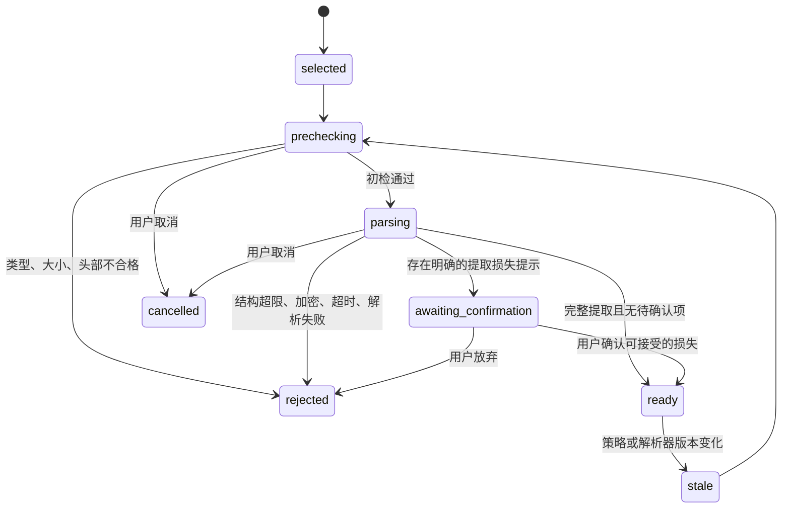

# 浏览器聊天网站开发设计

版本：0.1（待实现）

编写日期：2026-09-09

方案：静态网页 + Cloudflare Worker + IndexedDB 本地历史和附件

本文是独立聊天网站的开发与验收规范，不表示功能已经实现或完成真实上游验收。
现有 Gateway 继续承担认证、模型权限、额度和上游转发；聊天网站建议在独立项目中实现。
本仓库只收录设计文档，不在这一阶段修改 Gateway 代码、数据库或部署配置。

“文档审查”在本文中指文件格式、结构、资源消耗和可提取性检查。它不等同于
内容合规审核、杀毒认证或对文档真实性的验证。默认不调用模型进行文件审查。

## 1. 产品目标与首版范围

用户打开网页，输入自己的 Gateway API Key，进行带附件的多轮对话。
聊天记录、原始附件及提取结果保存在当前设备的浏览器中。
用户点击发送后，仅将本轮需要的文字和规范化图片发送到 Worker，再转发到 Gateway。

首版必须提供：

- 会话列表、新建、重命名、删除、历史查看、回复重试和停止生成。
- 文字和图片输入；普通文本 PDF、DOCX、TXT、Markdown、JSON、CSV 的本地解析。
- 附件导入前检查、处理中取消、拒绝原因、提取预览和发送内容确认。
- IndexedDB 持久化、已生成内容的定期保存、刷新后的中断状态恢复。
- 带附件的备份导出与导入、存储占用提示、缺失附件处理。
- 响应式桌面和手机界面；离线时可查看已保存历史。

首版不提供：

- OCR、扫描文档识别、复杂版式复原、自动处理上百页资料。
- XLS/XLSX、PPT/PPTX、旧版 DOC、DOCM、压缩包、音视频等文件导入。
- 模型修改文件、执行终端、调用插件或后台持续执行任务。
- 云端聊天历史、跨设备自动同步、共享链接和服务器全文搜索。
- 依赖上游 Files、Conversations、Embeddings API 的工作流。

XLSX 的“只读单元格值”支持可以作为后续独立功能评审。首版明确拒绝，不通过改扩展名
或调用不受限的通用 Office 解析器变相接入。用户可以先在本地导出有需要的 CSV。

## 2. 与现有 Gateway 的契约

以下是代码核对结果，不是新网站可自由调整的默认值：

| 项目 | 当前 Gateway 行为 | 网站要求 |
| --- | --- | --- |
| 模型查询 | `GET /v1/models` | 以当前 Key 返回的模型交集为准 |
| 生成 | `POST /v1/responses` | 使用 HTTPS/SSE |
| 压缩 | `POST /v1/responses/compact` | 首版不依赖，后续单独验收 |
| WebSocket | `GET /v1/responses` 认证后返回 426 | 不探测，不建立 WebSocket |
| Chat Completions | 没有对外路由 | 不调用 `/v1/chat/completions` |
| 文件、向量接口 | 没有对应对外路由 | 不调用 `/v1/files`、`/v1/embeddings` |
| API 认证 | 每个请求使用用户自己的 Bearer API Key | 不复用管理台 Cookie，不配置共享 Owner Key |
| 请求大小 | 整个 JSON 请求不超过 64 MiB | 网站设置更小的独立上限 |
| 内容保留 | 不持久保存对话正文；请求处理期间会暂存请求体 | 不宣传“内容从不经过服务器” |

实现依据见 [路由](../internal/server/server.go)、[认证](../internal/server/middleware.go)、
[转发白名单](../internal/proxy/client.go)、[请求暂存](../internal/server/model.go)和
[客户端说明](client-config.md)。

当前锁定的 CLIProxyAPI 在 Codex 普通与流式请求中删除 `previous_response_id`。
因此网站必须自己组织每轮上下文，不能只保存一个 Response ID 并依赖上游续聊。
上游公开 Responses API 的全部能力不能自动视为当前 OAuth 通道的能力，见文末来源。

## 3. 架构与信任边界



### 3.1 各层职责

| 层 | 负责 | 不负责 |
| --- | --- | --- |
| 浏览器界面 | 交互、消息状态、上下文选择、密钥临时持有 | 上游账号和额度判定 |
| 浏览器解析 Worker | 原文件检查、限量解析、图片规范化 | 网络访问、运行文件内代码 |
| IndexedDB | 保存本机历史、Blob 和解析产物 | 自动跨设备同步、可信身份认证 |
| Cloudflare Worker | 固定上游、认证探测、规范化请求校验、SSE 转发 | 接收原始 Office/PDF、OCR、聊天数据库 |
| Gateway | API Key、模型权限、配额、计费与转发 | 网页会话和附件库 |

两个“Worker”含义不同：浏览器 Dedicated Worker 在用户设备运行；Cloudflare Worker
在 Cloudflare 运行。把解析放入浏览器 Worker 可以减少界面阻塞，但不是带有独立
内存配额的安全容器，也不能保证恶意文件永远无法导致浏览器进程内存不足。

### 3.2 原文件检查与服务端检查不能相互替代

原始 PDF、DOCX 不发送给 Cloudflare Worker。它只能检查收到的规范化文字和图片，
无法证明原 PDF 的页数、DOCX 的解压量或客户端是否真的完成审查。

因此必须明确：

1. 浏览器检查保障正常产品流程的可用性，并降低原文件解析风险。
2. Worker 不信任客户端传来的 `reviewPassed`、页数、字节数和 Token 数。
3. Worker 独立执行实际请求字节数、类型、字段、文本和图片数量等硬限制。
4. Worker 不接受“客户端检查通过”的标记来豁免任何限制。
5. 浏览器检查可以被用户修改前端或直接构造请求绕过；不能将其称为服务器文件安全认证。

如果以后要求服务器也证明原文件安全，需要增加受限的原文件接收与隔离解析服务，
这会改变本方案的数据边界，必须另写设计。

### 3.3 对用户准确描述数据流

文件选择按钮使用“添加附件”，避免把本地导入和网络上传混为一谈。

- 选择文件：仅在本机读取和检查，不发送文件名、哈希或正文到服务器。
- 检查失败：停止处理，不加入可发送列表，不产生模型请求。
- 检查通过：保存到本机，展示实际提取内容。
- 点击发送：发送选中的提取文字、规范化图片及必要历史。
- 生成回复：内容经 Cloudflare、Gateway 和模型上游处理，保存在本机历史中。

“拒绝上传”在首版落地为“拒绝导入和发送”；已拒绝的原文件不会先传到服务器再审查。

## 4. 技术选型与项目边界

建议使用以下组合。具体依赖版本应在实现时审核并锁定，不使用浮动 CDN 脚本。

| 模块 | 建议 | 选择约束 |
| --- | --- | --- |
| 静态前端 | TypeScript + React + Vite | 构建 SPA，不引入必需的 SSR 服务 |
| 边缘后端 | TypeScript + Workers Module Worker | 仅 Web 标准 API 与已验证的兼容依赖 |
| 本地数据库 | IndexedDB，使用薄封装库 | 支持事务、版本升级与 Blob |
| PDF | Mozilla PDF.js | 固定版本；使用其解析 Worker 和公开 API |
| DOCX 容器 | 流式 ZIP 库，例如 fflate，配合受限 ZIP 目录检查 | 禁止直接整包 `unzipSync` 后再统计大小 |
| DOCX XML | 可在 Worker 运行的流式 XML 解析器 | 禁止 DTD、实体扩展和外部资源访问 |
| CSV | 支持分块、引号和换行的解析器 | 能在解析过程中限制行列和单元格数 |
| 图片 | 头部检查 + 浏览器解码和 Canvas 重编码 | 解码前先检查像素数，解码后再次核对 |
| Markdown 输出 | 默认禁用原始 HTML 的渲染器 | 不执行代码块，不自动加载远程图片 |
| 验证 | 单元测试、浏览器端到端测试、Worker 集成测试 | 附件拒绝规则和资源边界为发布必测项 |

独立项目的建议组织：

```text
browser-chat/
  apps/web/                  # 静态网页与浏览器解析 Worker
  apps/edge/                 # Cloudflare Worker
  packages/contracts/        # 请求、错误、策略和状态类型
  packages/file-review/      # 各类型检查器与规范化逻辑
  packages/local-store/      # IndexedDB 与备份
  tests/fixtures/            # 小型、可公开的审查样本
  tests/e2e/
  docs/
```

共享类型不等于共享信任：前后端可以共用策略常量和 Schema，但 Worker 必须从实际输入
重新计算可验证指标。前端“已经调用同一个校验函数”不是省略服务端校验的理由。

## 5. 首版限制策略

本节是产品初始策略，版本号 `file-policy-v1`；不是浏览器、OpenAI 或 Cloudflare
公开承诺的最大能力。所有容量使用二进制单位：1 KiB = 1024 B，1 MiB = 1024 KiB。
所有文字限额使用 UTF-8 编码后的字节数，不能用 JavaScript 字符串 `.length` 代替。

### 5.1 原文件与批次限制：浏览器执行

| 对象 | 首版上限或要求 |
| --- | --- |
| 单次添加附件 | 最多 4 个；其中图片最多 2 个 |
| 单次添加原文件总大小 | 20 MiB |
| TXT / Markdown / JSON | 单文件 1 MiB；仅接受可严格解码的 UTF-8，允许 BOM |
| CSV | 单文件 2 MiB |
| PDF | 单文件 8 MiB，最多 40 页 |
| DOCX | 单文件 5 MiB |
| JPEG / PNG / 静态 WebP | 单文件 8 MiB；最长边 8192 像素；总像素不超过 1200 万 |
| 空文件 | 拒绝 |
| 文件名 | 最多 200 个 Unicode 字符；拒绝 NUL、路径分隔符、控制和双向覆盖字符 |
| 文件解析并发 | 一个页面最多 1 个；支持 Web Locks 时同来源协调为 1 个 |
| 单文件检查与解析总时限 | 15 秒，包括头部检查、结构检查、提取和规范化，不含用户预览确认 |
| 单页 PDF 提取时限 | 2 秒，受 15 秒总时限约束 |

不根据设备内存自动放宽限制。低端设备可以使用更低上限；超时不自动重试。
文件大小检查在读取完整 ArrayBuffer 之前执行。多文件批次超过总数或总大小时，
整个批次拒绝，用户调整后重新添加；单个文件内容不合格时，其他合格文件可以保留。

### 5.2 解析与复杂度限制：浏览器执行

| 指标 | 首版上限或行为 |
| --- | --- |
| 单文档规范化文字 | 192 KiB |
| 一次添加的全部文档规范化文字 | 384 KiB |
| JSON 嵌套深度 | 32；语法错误拒绝 |
| CSV 数据行 / 列 / 非空单元格 | 2000 / 50 / 50000，任一超限即拒绝 |
| CSV 单个单元格 | 8 KiB |
| DOCX ZIP 条目数 | 512 |
| DOCX 声明的解压总大小 | 32 MiB；声明未知或不一致时拒绝 |
| DOCX 实际处理的解压总大小 | 32 MiB，解压过程中累计，不在完成后才检查 |
| DOCX 单条目解压大小 | 8 MiB |
| DOCX 压缩比 | 总体及单条目均不超过 100:1；对压缩大小为 0 的非空条目拒绝 |
| DOCX XML | 深度最多 64、所有 XML 合计事件/节点计数最多 200000；禁止 DTD 和实体定义 |
| DOCX 表格 | 最多 50 个、总单元格最多 5000；不接受嵌套表格 |
| DOCX 内嵌图片 | 最多 8 张、声明的媒体总解压大小最多 4 MiB；首版不提取图像语义 |
| PDF 文字项 | 每页最多 20000 项、整文件最多 100000 项 |
| PDF 缺少可提取文字 | 按第 6.4 节判定并拒绝，不自动转 OCR |
| 图片规范化 | 最长边 2048，编码后单图最多 1 MiB，输出仅静态 JPEG / PNG |

计数到达上限可以接受，超过上限立即中止。对文字、页数、行数和结构超限，不允许
“截取前一部分后作为完整文档通过”。需要用户自行拆分，或使用未来单独设计的显式选段功能。

### 5.3 每轮请求与响应限制：Worker 独立执行

| 指标 | 首版上限或要求 |
| --- | --- |
| 入站 JSON 请求体 | 4 MiB，实际流读取计数 |
| 重建后的 Gateway 请求体 | 4 MiB，发送前再次计数 |
| 请求 JSON 嵌套深度 | 16；拒绝重复键 |
| 消息数 | 最多 80 条，仅 `user`、`assistant` |
| 内容块总数 | 最多 128 个 |
| 单个普通文字块 | 192 KiB |
| 当前问题文字 | 32 KiB |
| 全部上下文文字 | 480 KiB，包括文档、历史、标签与固定说明的预留 |
| 全部上下文图片 | 最多 2 张，每张解码后编码文件最多 1 MiB |
| 图片格式 | 只接受严格 Base64 的 JPEG / PNG data URL，检查签名和尺寸 |
| 图片尺寸 | 最长边 2048；总像素最多 4194304 |
| 响应流总大小 | 16 MiB，超过后取消上游并返回可识别的流错误 |
| 单个 SSE 事件 | 4 MiB，与当前 Gateway 事件上限协调 |
| 可展示的累计助手正文 | 512 KiB，超过则取消并标记回复不完整 |

80 条消息、128 个块、480 KiB 文字和 2 张图均按整轮上下文计数，不能把超量内容
挪到旧消息、另一个字段或一个巨型数组里绕过。原文件总量不等于最终网络请求大小。

Worker 不接受压缩请求体，拒绝非空且非 `identity` 的 `Content-Encoding`。
`Content-Length` 只用于提前拒绝，不能代替真实流计数；缺失长度时仍执行相同限制。

客户端额外设置“目标输入上下文约 32768 Token”的体验阈值。匹配的 tokenizer 存在时
计算文本估算值；没有时用 UTF-8 字节数作为保守的文本估算上界，明确标注估算方式。
图像 Token 不使用固定通用公式冒充准确值。该估算不替代 Worker 字节限制、上游上下文
限制或 Gateway 的额度判定，也不构成单次费用上限承诺。

### 5.4 策略发布

`GET /api/config` 返回完整可公开策略及 `policyVersion`，不包含任何密钥。
前端缓存策略用于本地审查，Worker 使用部署绑定的策略作为权威。
发送时版本不匹配返回 `409 policy_outdated`，前端获取新策略并重新检查，不静默提交。

每条附件审查记录必须保存策略版本和解析器版本。旧附件在新版本下首次使用时重新验证；
没有必要原件或规范化产物时，要求重新添加，不能沿用旧的“通过”状态。

## 6. 文件审查与拒绝规则

### 6.1 状态机



只有 `ready` 可以进入发送队列。`awaiting_confirmation` 只能用于允许的提取损失，
不能用来让用户忽略大小、复杂度、加密、脚本、宏或超时等拒绝规则。

### 6.2 通用流程

1. 检查批次数量、`File.size`、扩展名、名称和空文件。
2. 有界读取头尾，交叉检查文件签名和容器结构。`File.type` 只是辅助信号；为空时
   不直接拒绝，出现矛盾时拒绝，不能只依赖扩展名或 MIME。
3. 将有界输入移交解析 Worker，启动页面侧独立看门狗计时器。
4. 按具体类型执行结构审查和增量提取，实时统计输出量和结构指标。
5. 检查实际产物的 UTF-8 字节数或图片编码大小，形成规范化结果。
6. 展示文件名、页数/行数、检查结果、提取预览和允许的损失提示。
7. 完成必要确认后，在一个本地提交流程中保存 Blob、结果和审查版本，再标记 `ready`。

异常、超时、解析器崩溃、指标无法可靠取得时，默认拒绝相应格式的导入。
异常信息映射为固定错误码，界面不展示解析库堆栈或原始文件片段。

取消必须销毁解析任务，释放 ArrayBuffer、ImageBitmap、对象 URL 及所有相关 Worker。
不能只令等待 Promise 超时而让底层继续解析。PDF.js 的加载任务和 Worker 应登记在
任务资源表中，确保取消和页面退出都能清理。主线程禁止 `eval`、宏执行、附件内脚本执行。

超时和计数仍无法给第三方解析器提供浏览器进程级内存硬配额。应通过小尺寸上限、
逐页处理、单任务并发、依赖更新和拒绝复杂结构共同降低风险；不使用
`performance.memory` 作为跨浏览器可靠的安全边界。

### 6.3 TXT、Markdown、JSON、CSV

- TXT / Markdown 作为文字读取；Markdown 附件先展示纯文字预览，不执行原始 HTML。
- UTF-8 解码使用严格错误模式。二进制 NUL、明显二进制内容或非法编码拒绝，提示用户
  重新保存为 UTF-8；首版不自动猜测 GBK 等编码。
- JSON 先用有界结构扫描限制深度，再解析有界正文。内容只作为文档文字，不合并到
  应用配置或 JavaScript 对象原型，不执行其中的表达式。
- CSV 使用正确处理引号、转义和字段内换行的解析器，不用 `split(',')` 代替。
  边解析边统计行、列、单元格和字段长度，不依赖最后一行给出的行号。
- CSV 的 `=...`、`+...` 等内容按普通文字保留，不计算公式；首版不提供可执行公式的
  电子表格导出。表格预览使用文本节点，不使用不受控的 `innerHTML`。
- 所有提取结果在标准化换行后重新测量字节数；超限拒绝，不自动删除长行或尾部。

### 6.4 PDF

首版接受有可用文字层的普通 PDF，仅提取文字，不把整个 PDF 渲染成图片。

检查顺序：

1. 检查签名与 8 MiB 文件上限，再创建 PDF.js 加载任务。
2. 遇到密码请求立即拒绝；不收集密码，也不尝试绕过文档保护。
3. 取得 `numPages`，超过 40 页立即销毁任务，不进入逐页提取。
4. 使用锁定版本的公开 API 检查附件、JavaScript 动作、打开动作、表单和 XFA，
   并检查后续逐页取得的页面动作和批注。文档级检查不能代替页面级检查。
   拒绝嵌入文件、脚本、启动/提交等主动动作及可填写表单。普通页内定位动作可以忽略；
   不把“设置初始缩放或跳页”本身视为恶意动作。
5. 逐页提取文字，优先使用可增量消费的文字流，检查页时限、文字项数量、总产物大小；
   处理完一页释放页面资源。不能收集整份文档的所有页面文字后才统计上限。
6. 以非空白 Unicode 字符计数，小于 40 个字符的页面标记为“文字不足”。全部页面
   均不足，或不足页超过 2 页且占比超过 20%，返回 `document_requires_ocr`。
7. 任何 API 报错或不支持必要检查时返回 `document_unverifiable`，不将该文件作为
   “检查通过”放行。相应适配器必须通过测试样本后才能启用。

第 6 条是首版可解释的保守规则，可能误拒图片封面较多的正常文档。错误提示使用
“缺少足够可提取文字，请先 OCR 或导出文字版”，不声称已经证明文件一定是扫描件。

单靠文字提取不能可靠识别所有多栏、图表和阅读顺序问题。所有 PDF 均显示
“仅分析提取文字；图表、图片和部分排版未保留”，要求用户查看预览并确认。
不能以“解析没有报错”宣称全文语义完整。需要图表分析时，用户应另行添加符合限制的图片。

不使用 PDF `iframe`、系统 PDF 查看器或自动执行的原始文档预览作为首版预览方式。
不抓取 PDF 中的外部 URL。PDF.js 具体配置项及上述 API 的覆盖范围，应按锁定版本核对；
不能把几个字节字符串搜索当作对压缩 PDF 中脚本和动作的完整检测。

### 6.5 DOCX

DOCX 是 ZIP 容器。首版按“普通文字 + 简单表格”处理，不使用桌面 Office 或转换服务。

容器检查必须在全文提取之前完成：

- 验证 ZIP 结构及 `[Content_Types].xml`、`_rels/.rels`、`word/document.xml` 等必要部件。
  检查 Word 主文档 Content Type；普通 ZIP 改名为 DOCX、DOCM 改名为 DOCX 均拒绝。
- 首版只接受有可验证中央目录的普通单卷 ZIP；拒绝 ZIP64、分卷、加密、未知压缩方法、
  重复路径、目录与局部头矛盾、异常偏移和 CRC 不一致。
- 拒绝绝对路径、`..`、NUL、路径混淆、符号链接和嵌套压缩包。虽然不向文件系统解压，
  也不允许这些条目进入逻辑部件映射。
- 先检查声明的条目数、解压大小和压缩比。任何数值溢出、缺失或无法验证都拒绝。
- 逐条目增量解压并校验，实时统计实际输出量；达到阈值即中断。非必要部件可丢弃输出，
  但不能绕过实际大小和 CRC 核对，也不能全部保留在内存。
- XML 使用受限流式解析，禁止 DTD、实体声明、外部实体和自动资源加载。

结构上明确拒绝：

- 宏、VBA、OLE、ActiveX、嵌入文件、外部模板或其他需外部内容才能解析的部件。
- 图表、SmartArt、复杂公式对象、嵌套表格、未处理的文本框等首版无法完整呈现的正文结构。
- 未接受的修订、批注或其他可能使“最终正文”含义不明确的结构。

普通外部超链接允许作为可见文字保留，但不请求目标 URL；不能因为存在外链就下载内容。
内嵌图片在数量和大小限制内可以忽略，其文件名和占位信息进入损失提示；用户必须确认
“图片未分析”。超过媒体阈值则拒绝，不能只丢弃图片后把复杂文档静默放行。

按文档顺序提取段落、标题、列表和简单表格；页眉、页脚、脚注、尾注分别加来源标签，
不混入正文顺序。DOCX 不提供可依赖的实际分页，不把元数据中的页数用于硬限制。

通用 ZIP 解压库只是基础设施。它是否支持头部一致性、CRC、加密条目标识等检查，
必须逐项验证；缺少的检查需增加有界适配器，未完成前保持 DOCX 功能关闭。

### 6.6 图片

1. 使用有界头部读取验证 JPEG / PNG / WebP 类型、尺寸和动画标记，再决定是否解码。
2. 首版拒绝 SVG、GIF、HEIC、动画 WebP、APNG 及其他未列入白名单的格式。
3. 像素或原文件字节数超限，在完整解码前拒绝；不能先解码超大图片再缩小。
4. 对合格图片解码、纠正方向，缩小并重编码为静态 JPEG / PNG；剥离元数据，
   不转发原始 EXIF 或原始容器。
5. 再检查输出签名、尺寸和实际编码大小。透明图片可保留 PNG；在有限次尝试内
   无法满足 1 MiB 上限时拒绝，不无限降低质量。
6. 用户查看实际发送版本；细字或图表压缩后不可读时提示裁剪或单独导出，不能宣称
   “原图无损上传”。

Worker 对最终图片再次进行 Base64、文件签名、结构和尺寸的有界检查，不运行完整图像
渲染器。浏览器重编码不能由客户端布尔值证明；Worker 的承诺限于实际校验过的指标。

### 6.7 错误码与用户提示

| 错误码 | 用户提示示例 | 可恢复操作 |
| --- | --- | --- |
| `unsupported_file_type` | 暂不支持此文件格式 | 转为支持的格式 |
| `file_type_mismatch` | 文件内容与格式不一致 | 重新导出原文件 |
| `file_too_large` | 文件为 12 MiB，PDF 上限为 8 MiB | 本地拆分或压缩 |
| `attachment_batch_too_large` | 一次最多添加 4 个附件、总计 20 MiB | 减少本次文件 |
| `document_too_many_pages` | 文档为 76 页，上限为 40 页 | 拆分需要分析的部分 |
| `document_too_complex` | 表格、部件或文本结构超过处理范围 | 导出简化文字版 |
| `archive_expansion_limit` | 文件解压后超过处理上限 | 重新导出精简 DOCX |
| `encrypted_document` | 暂不处理加密或需密码的文档 | 使用有权访问的未加密副本 |
| `active_content_not_allowed` | 文件包含宏、脚本或嵌入对象 | 导出不含主动内容的副本 |
| `document_requires_ocr` | 缺少足够可提取文字 | 先在本地 OCR |
| `document_unverifiable` | 无法完成此文件的结构检查 | 重新导出文字版 |
| `extracted_text_too_large` | 提取文字超过单文档 192 KiB 上限 | 拆分相关章节 |
| `document_parse_timeout` | 文件在 15 秒内未完成检查 | 简化文件后重试 |
| `document_parse_failed` | 文件无法可靠读取 | 重新导出文件 |
| `image_dimensions_exceeded` | 图片像素过大 | 本地缩小或裁剪 |
| `image_normalization_failed` | 图片无法转换为可发送格式 | 重新导出 JPEG / PNG |
| `local_storage_full` | 本机存储空间不足 | 导出备份后清理 |

界面必须指出具体文件及可采取的动作，不能只显示“上传失败”。拒绝记录可保留错误码和
本机显示用文件名，但默认不持久保留被拒绝的原件、半成品或原始解析异常。

## 7. 前端交互与发送流程

### 7.1 首次使用

1. 创建本机资料档案，说明历史仅保存在当前浏览器。
2. 用户输入专用于本网站的 Gateway API Key，通过 `/api/models` 验证。
3. 显示可用模型；无权限、无余额等情况按 Gateway 错误分别处理。
4. 询问是否允许浏览器持久保存本站数据，并提供立即导出备份的入口。
5. 新建会话，进入输入界面。

首版 Key 仅保存在页面内存，刷新、锁定或退出后需要重新输入。不写入 localStorage、
IndexedDB、URL、分析事件或备份。不要为省去输入而把所有用户请求改为共享 Key。

本机资料档案不是网关用户身份：`profileId` 只负责本地数据分组。重新输入或更换 Key 时
要求明确选择要使用的本机档案，不通过 Key 原文派生数据库加密密钥，也不因 Key 轮换
删除历史。首版不会自动将两个 Key 识别为同一用户；网站后台授权始终以实际 Key 为准。

### 7.2 附件卡片

每张附件卡片显示：

- 文件名、原始大小、格式、页数或记录数（可获得时）。
- 状态：检查中、等待确认、可发送、已拒绝、已取消、需重新检查。
- 发送内容：提取文字大小，或实际发送图片的尺寸与大小。
- 提取预览及具体损失说明，例如“文档含 3 张图片，本次仅提取文字”。
- 移除、取消检查、查看原因和重新选择操作。

检查未完成时可以继续输入问题，但不能发送带有未就绪附件的请求。
允许用户移除失败附件后发送其他内容，不自动忽略失败附件后发送。

### 7.3 发送前确认

发送前完成以下本地步骤：

1. 固定本轮会话分支、模型、用户问题和已选附件，生成不可变的本轮快照。
2. 验证相关附件为当前策略下的 `ready`，原始引用与提取内容一致。
3. 组织所需历史和附件内容，去除未选择的其他会话与重复的附件内容。
4. 计算规范化请求的真实 UTF-8 字节数、图片数量、文本总量与估算 Token。
5. 超限时阻止发送，提示移除附件、拆分文档或减少上下文，不静默截断。
6. 先把用户消息和待生成助手消息写入 IndexedDB，成功后再发出网络请求。

附件解析或本地保存失败不得自动降级为“先发送再说”。本地存储不可用时首版提供明确
的“临时文字聊天”入口，用户确认后仅允许文字聊天，不支持附件和持久历史。

用户确认提取模式不意味着浏览器记住了对所有未来文档的授权。确认绑定到当前
`sourceSha256 + normalizedSha256 + policyVersion + parserVersion`，内容或版本变化后失效。

## 8. Cloudflare Worker API

网站 API 使用应用自己的小型契约，由 Worker 构造 Responses 请求。
不向浏览器开放一个可以任意透传所有 Responses 字段的通用代理。

### 8.1 路由

| 方法与路径 | 认证 | 行为 |
| --- | --- | --- |
| `GET /api/config` | 无需 Key | 返回公开策略、契约版本和网站功能开关 |
| `GET /api/models` | 用户 Gateway Bearer Key | 查询 Gateway 并过滤网站已验收模型 |
| `POST /api/chat` | 用户 Gateway Bearer Key | 校验规范化正文，转为 Responses，返回 SSE |

其他 `/api/*` 路径返回 JSON 404。它们不能落入 SPA 的 `index.html` 回退。
不提供 `/api/upload`、任意 URL 抓取、网页截图、共享下载或附件代理接口。

### 8.2 请求示例

下例省略图片的实际 Base64 内容。`model` 的值必须来自 `/api/models`，示例中的模型
字符串仅为占位符，不是可直接运行的配置。

```json
{
  "schemaVersion": 1,
  "policyVersion": "file-policy-v1",
  "clientRequestId": "e2d08f09-2f1e-4a84-8fbd-5fc7424b6144",
  "model": "<来自模型列表的已验收模型 ID>",
  "messages": [
    {
      "role": "user",
      "content": [
        { "type": "text", "text": "这份材料主要讨论什么？" }
      ]
    },
    {
      "role": "assistant",
      "content": [
        { "type": "text", "text": "材料主要讨论项目的实施安排。" }
      ]
    },
    {
      "role": "user",
      "content": [
        { "type": "text", "text": "请结合附件列出需要确认的问题。" },
        {
          "type": "document_text",
          "name": "实施安排.pdf",
          "text": "[第 1 页]\n这里是已审查并预览的提取文字。"
        },
        {
          "type": "image",
          "mimeType": "image/jpeg",
          "base64": "<规范化 JPEG 的 Base64>"
        }
      ]
    }
  ]
}
```

契约要求：

- 顶层仅接受示例列出的字段；可选推理强度等参数在完成模型能力核对后单独扩展 Schema。
- `clientRequestId` 必须为合法 UUID，仅用于前端关联，不代表幂等、授权或可信身份。
- 消息至少一条，最后一条必须为 `user`，其中恰好一个非空 `text` 块代表当前问题，
  最多 32 KiB；该条额外附件块最多 4 个、图片最多 2 个。
- 每条 `user` 消息恰好一个普通 `text` 块，其他块只能是 `document_text` 或 `image`。
- `assistant` 消息只允许一个 `text` 块，不能带图片、文档、工具调用或客户端伪造的系统指令。
- 单个 `document_text.text` 最多 192 KiB，最后一条消息的文档文字合计最多 384 KiB。
- 全部消息仍需满足第 5.3 节的合计限制，文档名和 Worker 插入的来源说明计入文字预算。
- 图片 Base64 必须使用标准字母表与规范填充，禁止空白、非规范编码和外部 URL。
- 不接收原文件、页数、客户端审查证明、`file_id`、`previous_response_id`、`tools`、
  `instructions`、任意 `metadata`、账号标识或自定义上游地址。

### 8.3 Worker 请求处理顺序

1. 根据固定路由判断请求；限制方法、Origin、Content-Type 和请求头长度。
   `/api/chat` 只接受 `application/json`，拒绝意外 Content-Encoding。
   已声明 `Content-Length` 超过 4 MiB 时提前拒绝；没有声明则继续有界读取。
   在模型查询或读正文之前申请入口许可：每个 isolate 最多 4 个活跃的受保护 API 请求，
   包括认证查询与仍在生成的长流；满时立即返回 `503 edge_busy`，不缓存等待中的正文。
2. 提前检查 Bearer Key 的格式，执行 IP 级边缘限流；Key 的实际认证仍由 Gateway 完成。
3. 通过固定地址的 `GET /v1/models` 验证 Key，并取得本次允许的模型集合。
   认证失败立即返回，不读取和解析多 MiB 正文。模型查询响应设 1 MiB 有界读取上限。
4. 进入 isolate 内的有界解析许可区，同时最多处理 2 个请求的读取、验证和重建阶段；
   满时返回 `503 edge_busy`，不将请求体放入无界等待队列。
5. 有界读取请求流，超过 4 MiB 立即取消读取并返回 413。
   读取过程中不同时保留无限数组的分块和多份字符串；实现时记录峰值分配情况。
6. 对正文严格解码 UTF-8，无效编码拒绝；对有界 JSON 执行深度和重复键检查，
   再解析 Schema，验证版本与本次模型集合。
7. 逐项重新测量文字，验证图片 Base64、签名、非动画结构和尺寸。
8. 构造全新的 Responses 请求对象，禁止使用对象展开把客户端未知字段带入上游。
9. 对重建后的 UTF-8 JSON 再次检查 4 MiB 上限，并开始一次上游生成请求。
10. 释放不再需要的入站对象与解析许可；流式阶段不能因闭包继续持有多份完整请求。
11. 以有界 SSE 解析/转发器处理响应，结束、异常或取消时释放 reader、计时器及上游请求，
    在 `finally` 或等效的流清理路径释放入口许可。所有提前返回也必须释放已获得的许可。

流请求的入口许可要持续到响应体关闭或取消，不能在 HTTP handler 返回 `Response` 对象时
就释放。解析许可在不再需要解析对象时释放，不应为了等待模型思考而继续占用。

这意味着一次正常 `/api/chat` 默认产生一次模型查询和一次生成请求。
模型查询不计生成费用，但仍有网关数据库和网络开销。首版不跨用户缓存认证结果；
如以后增加认证缓存，必须明确 Key 撤销延迟，且不能以原始 Key 作为日志或缓存键。

isolate 内的入口及解析许可只控制本实例内存，不构成全球并发或用户配额。
长流也计入入口许可，因为每条流可能同时持有一个较大的 SSE 事件；只限制请求 JSON
解析并发、不限制活跃流，无法约束响应缓冲带来的内存峰值。
边缘限流可以按 IP 和经服务器密钥 HMAC 后的 Key 标识执行，不记录原始 Key；
全局及跨设备的最终配额继续由 Gateway 判定。生产平台的限流设施、计数范围及失败行为
需要实际配置并测试，不能用 Worker 全局变量声称实现了分布式限流。

### 8.4 固定上游和头部

`GATEWAY_ORIGIN` 由部署配置指定为一个 HTTPS 来源；路径在代码中固定为
`/v1/models` 和 `/v1/responses`。客户端不能通过 URL、Header 或正文修改目标。
上游 fetch 使用手动重定向策略，遇到重定向报错，不能把用户 Key 带到新来源。

向 Gateway 仅发送必要头部：

- `Authorization: Bearer <当前用户 Key>`。
- `Content-Type: application/json`（生成请求）。
- `Accept: text/event-stream`（生成请求）或 `application/json`（模型查询）。

不转发浏览器 Cookie、伪造的转发 IP、上游账号选择、内部亲和性头或任意调试头。
首版使用 Key 的默认项目，不开放自由填写 `X-Codex-Project`；将来需要项目选择时单独设计。

网站为每次 HTTP 请求生成 `X-Webchat-Request-ID`，同时在格式有效时保留 Gateway 的
`X-Gateway-Request-ID`。不把上游任意响应头全部透传给浏览器。

### 8.5 Responses 映射

| 应用契约 | 发往 Gateway 的内容 |
| --- | --- |
| 用户 `text` | 用户消息中的 `input_text` |
| 用户 `document_text` | 用户消息中的 `input_text`，加规范化来源标签 |
| 用户 `image` | 用户消息中的 `input_image`，使用 `data:image/...;base64,...` |
| 助手 `text` | `{ "role": "assistant", "content": "历史助手正文" }` |
| 模型 | 经 Gateway 及网站能力表共同允许的精确 ID |
| 流式与保存 | Worker 固定 `stream: true`、`store: false` |
| 工具 | 不注册客户端工具，不执行任何工具回调 |

固定应用指令由 Worker 生成，说明附件是待分析资料、可能包含不可信指令，来源标签不是
授权信息。标签和文件名必须转义；不要把附件内容放入系统或开发者指令中。
这种分隔可以降低误解，但不构成消除提示注入的保证；真正的执行边界是网站没有赋予
模型文件修改、网络抓取或终端工具。

工具字段不存在或为空不能证明上游兼容层不会自行附加工具。当前锁定执行器存在
按配置补充图片生成工具的逻辑，因此首版必须验收实际返回事件：网站不执行工具，
出现需要工具执行或不支持的生成产物时标记 `unsupported_response_item` 并停止。
不能为“兼容”而自动启用工具。若基础文字请求也持续产生不支持项，暂停该模型的网站入口。

`store: false` 是发出的请求参数，不是对所有上游日志、缓存或保留政策的认证。
不承诺输出 Token 参数在此 OAuth 通道一定生效；前端显示实际返回的 usage，
响应大小和超时限制只用于保护应用，不能当作精确的金额上限。

## 9. SSE、失败和取消

客户端使用带 Authorization 的 `fetch()` 读取流，不使用无法方便携带该头的原生
`EventSource`。SSE 解码必须支持 UTF-8 跨块、事件跨块、多行 `data:`、CRLF、心跳注释
及单网络分块中包含多个事件；不能按 TCP 分块直接 `JSON.parse`。

| 事件或情况 | 行为 |
| --- | --- |
| `response.created` / `response.in_progress` | 记录生成已开始，不宣称已有正文 |
| `response.output_text.delta` | 追加对应输出项的正文，按输出项和内容索引关联 |
| `response.output_text.done` / 消息项完成 | 核对或补齐正文，不能和已收到 delta 重复追加 |
| `response.completed` | 记录最终正文、usage、响应 ID，完成本地事务 |
| `response.failed` / `error` | 保存部分正文，标记失败，展示安全错误 |
| `response.incomplete` | 保存部分正文，标记不完整，展示原因 |
| 拒绝回答相关事件 | 正常显示模型的拒绝文本，不作为网络故障自动重试 |
| 普通 reasoning 元数据 | 可以忽略或保存有限的公开摘要；不假造隐藏推理文本 |
| 工具调用、工具产物、未知执行类项 | 不执行，返回 `unsupported_response_item` 并终止 |
| 新的非执行类元数据事件 | 在事件大小限制内忽略，不能因此截断已经生成的正文 |
| 流结束但没有合法终止事件 | 标记 `interrupted`，不能标记成功 |

Worker 只缓冲一个有界事件，不聚合整个响应。规范化转发时，模型正文按原值传递，
错误事件仅保留安全类型、固定映射消息和请求 ID，不传递任意上游调试信息。
本地终止可使用 `event: webchat.error`，其 `data` 使用第 9.1 节错误结构；
已经开始 SSE 后不能再返回一段普通 HTTP JSON 假装修改状态码。

在出现非支持产物之前已经显示的文字保留为“不完整回复”，不能悄悄丢弃。
最终消息和 delta 的对账应使用当前 Responses 的 output item / content 索引；
保留 `response.id` 仅用于诊断，不用于 `previous_response_id` 续接。

### 9.1 错误结构

```json
{
  "error": {
    "code": "request_too_large",
    "message": "本轮内容超过 4 MiB，请减少附件或上下文。",
    "requestId": "<网站请求 ID>",
    "gatewayRequestId": null,
    "retryable": false
  }
}
```

| HTTP 状态 | 错误类别 | 客户端动作 |
| --- | --- | --- |
| 400 | 契约、JSON、模型参数或图片结构错误 | 修正输入，不自动重试 |
| 401 | Key 无效、过期或已撤销 | 清除内存 Key，重新输入 |
| 403 | 模型、用户或 Key 权限拒绝 | 显示权限提示；模型错误不要求用户删除历史 |
| 409 | 策略版本变化 | 更新策略，重新检查受影响附件 |
| 413 | 实际请求或内容大小超限 | 减少附件或上下文 |
| 429 | 网关或边缘配额限制 | 展示安全的 `Retry-After`，用户决定何时重试 |
| 502 / 504 | 上游故障或超时 | 保留草稿与部分结果，允许手动重试 |
| 503 | 边缘忙、网关忙或上游需重新登录 | 根据具体错误码提示；重新登录上游由管理员处理 |

Gateway 已有的安全错误码应建立显式映射，例如 `insufficient_quota`、`model_not_allowed`、
`request_spool_busy`、`upstream_reauthentication_required`。未识别的上游消息使用通用提示，
不把任意字符串直接呈现给用户。错误正文最多读取 16 KiB，超过后丢弃剩余部分。

### 9.2 超时与取消的初始配置

| 阶段 | 初始限制 |
| --- | --- |
| Gateway 模型查询 | 10 秒 |
| 读取浏览器请求体 | 30 秒 |
| 等待 Gateway 生成响应头 | 100 秒；当前 Gateway 内部上游响应头超时为 90 秒 |
| 两次上游流字节之间的空闲时间 | 120 秒；只由真实上游数据重置 |
| 单次生成总墙钟时间 | 10 分钟，网站自己的产品限制 |
| 连接保活注释 | 无输出时每 15 秒一次，可由 Worker 发送 SSE 注释 |

自发心跳不能重置上游空闲计时器。所有超时值由网站部署配置管理，并在真实
Cloudflare Tunnel 链路中验收；不能因为 Worker 本身允许长连接就忽略中间层超时。

用户点击停止后，浏览器 AbortController、Worker 的输出流取消回调及上游 fetch
必须联动。实现中显式转发取消，不假设客户端断开必然立即取消每个子请求。
`waitUntil()` 不用于维持被用户取消的模型生成。

首版不自动重试生成请求，尤其不能在网络错误或流中断后自动重发。
`clientRequestId` 没有在 Gateway 提供计费幂等，重试可能产生新的额度消耗。
手动重试生成新的 attempt ID，原来的部分结果保留；不从错误提示推断上游一定没有执行。

## 10. 上下文组织

显示历史和模型输入分开建模。完整历史保留在本机；每轮只选择当前分支需要的上下文。

- 首版使用当前分支的完整可用文字历史与仍附着的相关附件，发送前计算所有上限。
- 超限时提供移除附件、选择从某条消息开始或新建会话；所有缩减必须明确显示。
- 不默认启用自动摘要、自动标题模型和建议问题生成，以免产生隐含的额外调用。
  会话默认标题由第一条用户问题在本机截取。
- 同一附件在一次请求中只注入一次完整内容，放在该分支首次引入它的位置；后续引用
  只使用稳定标签。若用户选择的上下文已排除首次引入位置，则在新的首次引用处补入内容。
- 附件是否继续进入下一轮上下文由会话附件列表表示，不依赖模型“记得”附件名。
- 图片在整个上下文中最多 2 张；增加第 3 张前需显式移除旧图的上下文引用。
- 缺失附件的历史仍可查看，但继续发送时必须明确移除该引用或重新添加，不能只发送
  一个失效的 Blob URL、文件名或未经当前会话绑定的本地 ID。

资料标签示例为 `附件 A1：实施安排.pdf，提取文字，第 1–5 页`。页码来自解析产物；
DOCX 不产生伪造页码。标签不包含服务器文件路径，不作为可被模型请求读取的系统资源。

首版只支持文字/图片聊天，重放助手可见文字，不重放工具链和加密 reasoning 项。
这可能与完整代理客户端保留推理状态的行为不同，不能宣称完整复刻 Work。
后续若增加工具或推理状态续接，需要新增结构化输入项 Schema、存储模型和兼容测试，
不能把历史 SSE 原样塞入 `input`。

## 11. IndexedDB 设计

数据库名建议 `webchat-local`，Schema 版本独立于应用构建版本和附件策略版本。
每条业务记录带 `profileId`；所有查询和写入都显式限制本机档案。

### 11.1 Object stores

| Store | 主键 / 主要索引 | 主要内容 |
| --- | --- | --- |
| `profiles` | `id` | 本机档案名称、创建时间、偏好；不存 Key |
| `conversations` | `id`；`[profileId, updatedAt]` | 标题、当前分支、模型、修订号、时间 |
| `messages` | `id`；`[profileId, conversationId, createdAt]` | parent ID、角色、内容、附件 ID、attempt 与状态 |
| `attachments` | `id`；`[profileId, sourceSha256]` | 原名、格式、原始大小、Blob ID、提取产物 ID、状态 |
| `blobs` | `[profileId, sha256]` | 原件或规范化图片 Blob、用途、实际字节数 |
| `extractions` | `[profileId, attachmentId, policyVersion, parserVersion]` | 提取文字、来源映射、指标、损失提示、确认状态 |
| `generationRuns` | `id`；`[profileId, conversationId]` | 网站/Gateway 请求 ID、Response ID、开始时间、结果状态、usage |
| `settings` | `[profileId, key]` | UI 偏好、模型选择、存储提示；不存身份凭证 |

附件哈希用于同一档案内本地去重，不发送到日志或统计服务，也不作为文件安全认证。
原文件哈希与规范化图片/文字哈希分别保存；多个会话引用相同 Blob 时不重复存储。
删除采用事务内引用检查，并提供启动时的孤儿记录清理，不单独依赖易失效的内存引用计数。

### 11.2 一致性与流式保存

- 解析产物在内存中完成必要检查后写入；多 Store 写入使用 IndexedDB 事务。
  不在活跃事务中等待网络、长时间解压或 WebCrypto 计算。
- 一旦出现 quota / transaction 错误，整次附件提交失败，不能留下 `ready` 的空记录。
- 发送前在事务中建立用户消息、助手占位消息和 `generationRun`；提交后才调用 Worker。
- 助手 delta 在内存聚合，每 500 毫秒最多持久化一次；结束、停止和错误时立即尝试最终保存。
  不按每个 Token 写数据库。字数限制和流量限制独立于保存节奏执行。
- 存储写入失败后终止本轮生成、保留可导出的内存内容，明确提示结果尚未可靠保存。
- 刷新时把遗留 `preparing` / `streaming` 标记为 `interrupted`。不在刷新后自动重新生成。
- 同一会话同一时间只允许一个活跃生成；优先使用 Web Locks，缺失时采用 IndexedDB
  事务中的租约和版本检查。BroadcastChannel 只负责通知，不单独承担互斥。
- 修改已有用户消息时创建分支或新消息，保留已有后续历史，不覆盖另一标签页的写入。

### 11.3 本机存储策略

首版设置 200 MiB 的应用自有数据预算，按已知 Blob/文字真实大小统计并预留约 20% 索引
和序列化余量。它是应用预算，不是浏览器给予的存储保证。

- 达到应用预算 80% 时提醒；预计新导入超过预算时拒绝附件导入并保留清理/导出功能。
- 使用 `navigator.storage.estimate()` 辅助判断可用空间；结果是估算值，仍必须捕获真实写入失败。
- 通过 `navigator.storage.persist()` 请求持久化，并显示是否获批；不承诺不会丢失。
- 清除站点数据、设备损坏、浏览器重装和隐私模式结束都可能使数据不可恢复。
- 应用更新保持正式来源不变；预览域名、正式域名和另一个子域名的数据不能自动互通。
- Service Worker 若启用，只缓存应用外壳和固定资源；不缓存 `/api/*`、Key、SSE 或附件内容。

只保留原件路径、文件名或 `blob:` URL 不足以持久保存附件；必须保存 Blob 本体，
打开历史时重新创建临时对象 URL，并在使用结束后撤销。

### 11.4 备份与恢复

首版导出 `.chatbackup` 文件，使用不压缩的 ZIP 容器，包含 `manifest.json`、
规范化的会话/消息记录及必要 Blob。禁止导出 API Key、Cookie、环境配置或解析器异常日志。
界面明确提示“备份未加密，请妥善保存”。加密备份或云同步另行设计，不使用临时自创加密方案。

单份备份总文件大小和条目累计实际大小均不超过 100 MiB，最多 2000 个条目；
超限时要求按会话拆分导出。导出前完成相同大小检查，确保自己生成的备份可被导入。

导入必须验证：

- 备份版本、路径白名单、条目重复、声明/实际大小、CRC、Blob 哈希与引用完整性。
- 首版只接受此格式的 Store（不压缩）ZIP；拒绝加密、ZIP64、分卷、链接和其他压缩方法。
- JSON 必须是受限的声明式数据，不能包含可执行配置、服务器系统消息或工具执行状态。
- 输入文件不超过 100 MiB，逐条目处理；单个 Blob 仍执行该类型的原文件上限；
  单个记录分片不超过 4 MiB，JSON 深度不超过 16，文本消息上限为 512 KiB。
- 导入到用户明确选择的本机档案，重新映射 ID，禁止覆盖同 ID 的现有记录。
- 附件原件按当前审查策略重新检查；不能相信备份中的 `ready` 或旧的确认状态。

导入采用“分批暂存 + 完成标记 + 最后发布”流程。失败或取消后清理暂存数据；
导入前估算空间，预留现有数据与暂存数据同时存在的容量。
恢复的聊天可以保留不再符合当前发送上限的历史，但必须标记相关附件不可发送，
直到重新检查通过或用户移除该引用。

## 12. 内容、凭证与本地隐私

### 12.1 页面执行边界

- 附件、导入备份、文件名、模型输出都视为不可信输入。
- 禁用原始 HTML 渲染，代码块只展示；不得执行回复中的 JavaScript、Shell 或 SQL。
- 远程图片不自动加载；用户显式打开外部链接时使用 `noopener` / `noreferrer`。
- 不把附件写入可执行静态目录，不注册附件中的 Service Worker，不生成可执行 HTML 预览。
- 不把模型建议当成文件操作授权。下载回答文本是用户点击后的普通网站导出功能。
- 不接入广告、第三方聊天分析脚本或会读取页面内容的会话回放服务。

主页面采用严格 CSP，按实际资源逐项配置 `default-src 'self'`、`script-src 'self'`、
`connect-src 'self'`、`worker-src 'self'`、`object-src 'none'`、`frame-ancestors 'none'`，
仅为必要的本地图片预览允许 `img-src` 中的 `blob:` / `data:`。
不为让解析库运行而整体加入 `unsafe-eval` 或通配网络来源。

解析 Worker 脚本单独配置 CSP，限制 `connect-src 'none'`。解析库若需要固定字体或其他
静态数据，由宿主从构建内的固定资源路径预加载；不能根据附件中的 URL 获取资源。
不要假设主页面 CSP 的 `connect-src` 自动为所有独立 Worker 提供相同的网络限制。
选择不依赖动态 Blob 脚本的打包方式；ZIP 流式解析可以在专用 Worker 内同步分块执行，
由页面控制超时，无需开启无界的库内多线程。

### 12.2 认证与本机数据是两套边界

当前 Gateway Bearer Key 只控制服务器调用权限，不能保护已写入同一浏览器的明文历史。
本机资料档案分组也不是加密隔离。首版必须说明：能访问该浏览器配置和站点数据的人，
可能读取其中的历史和附件。

退出操作提供两个独立动作：清除内存 Key；另行选择是否清除该档案的本机历史。
不能默认删除历史，也不能把“已退出网关”显示成“本机数据已被加密”。
本地数据加密和独立解锁可以在后续版本设计，但必须有密钥恢复与备份策略，且不能防止
页面在已解锁状态下遭到 XSS 后读取明文。

Worker 的 Origin / Fetch Metadata 检查用于约束浏览器调用，不代替 API Key 认证。
非浏览器可以伪造 Origin；不允许凭这些请求头获得共享密钥或跳过网关认证。

### 12.3 日志和缓存

Worker 不使用 KV、D1、R2、Cache API 或 Durable Objects 存储聊天正文、图片、附件原件、
提取结果和 API Key。边缘限流设施如需状态，只保留短期计数与不可逆的限流标识。

允许的运行指标限于：网站请求 ID、可公开的错误码、状态、大小区间、处理耗时、
超时阶段与取消原因。不记录文件名、文件哈希、正文、模型完整事件和原始异常对象。
模型 ID 等可识别用户工作习惯的维度默认不写日志，确需启用时在部署文档中说明。

`/api/models`、`/api/chat` 及错误返回均使用 `Cache-Control: no-store`。
生产关闭正文调试和自动请求回放；核对 Cloudflare Observability、Logpush、错误收集工具
以及反向代理的配置，不能只删掉一处 `console.log` 就声称没有内容日志。

本地存储不是端到端保密计算。发送时内容必然经过 Cloudflare、Gateway 和模型服务；
网站自己的“不持久保存”策略不替代这些服务的适用政策。

## 13. Cloudflare 部署设计

### 13.1 域名与路由

建议使用两个固定来源：

```text
https://chat.example.com       静态资源和 /api/*，由 Worker 承载
https://gateway.example.com    现有 Gateway 的 Cloudflare Tunnel 入口
```

浏览器只请求 `chat.example.com`，由 Worker 服务器侧访问固定 Gateway，避免依赖
Gateway 的 CORS。不要将 Worker 套到自己的上游域名上造成递归代理。
保留 Gateway 现有管理台来源，不在聊天域名下复制其认证 Cookie 或嵌入管理台。

生产使用 Workers Static Assets 部署 SPA 和 API Worker。`/api/*` 先进入 Worker；
静态资源可缓存，API 和错误不可缓存；`/parsers/*` 等解析资源应用独立安全头。

首版不需要聊天服务器容器、聊天 PostgreSQL、向量数据库或对象存储。
模型转发仍会消耗现有 Gateway 的内存、网络和并发额度，不宣称新增聊天用户零成本。
当前网关请求暂存在上限 320 MiB 的 tmpfs；采用 4 MiB 网站请求上限可降低单请求压力，
但并不能排除同服务器其他客户端提交更大请求，见 [Compose 配置](../docker-compose.yml)。

### 13.2 配置和秘密

| 名称 | 类型 | 说明 |
| --- | --- | --- |
| `PUBLIC_ORIGIN` | 普通配置 | 正式聊天来源 |
| `GATEWAY_ORIGIN` | 普通配置 | 固定 HTTPS 网关来源，不允许用户覆盖 |
| `POLICY_VERSION` | 构建/部署配置 | 与客户端策略协商 |
| `APP_CONTRACT_VERSION` | 构建/部署配置 | API 契约版本，首版 1 |
| `MODEL_CAPABILITIES` | 经审核的配置 | 已验收模型、图像支持、可选参数；只缩小 Gateway 返回集合 |
| `FEATURE_PDF` / `FEATURE_DOCX` / `FEATURE_IMAGES` | 功能开关 | 对应适配器未通过验收前关闭 |
| 超时和内容上限 | 共享策略配置 | 前端展示；Worker 独立执行 |
| `RATE_LIMIT_HMAC_SECRET` | Worker Secret，启用 Key 限流时使用 | 仅生成限流标识，不是上游 Key |

不配置共享 `OPENAI_API_KEY`、Owner Gateway Key、ChatGPT OAuth Token 或内部 sidecar Key。
网站部署人员不需要访问 `deploy/secrets/*` 或 OAuth 卷。

`MODEL_CAPABILITIES` 不应自动把 `/v1/models` 的所有 ID 标记为图像可用，也不能暴露
`codex-auto-review` 等内部治理模型作为普通聊天选项。新模型先通过文字、图片和历史续接
测试，再加入能力表；定价和权限的最终判断仍由 Gateway 执行。

### 13.3 资源预算

普通 Worker 当前每个 isolate 128 MB 内存，多个并发请求可能共用。4 MiB 请求上限
是为了给解析对象、图片检查、重建 JSON、单个 4 MiB SSE 事件及并发留出空间。
入口最多 4 个活跃 API 请求、其中最多 2 个进入请求解析阶段，两种许可必须同时生效。
它不是已经完成的内存证明，发布前必须测量最坏边界请求和并发峰值。

首版选择 Workers Paid，初始 CPU 配额可设为每请求 1000 ms，用真实样本验证并调整。
该值是应用预算，不是对实际耗时的预测。等待上游网络不计 CPU 时间，但流式事件解析、
JSON 重建和校验会计入。免费方案的 10 ms CPU 限额不作为本方案生产验收目标。
平台限制以部署时的 [Workers Limits](https://developers.cloudflare.com/workers/platform/limits/) 为准。

浏览器资源控制使用输入上限、逐项处理和取消机制。不要为了通过某个超限样本直接把
全部上限翻倍；需要记录解析耗时、是否阻塞界面和实测峰值后再调整策略版本。

### 13.4 版本、兼容性和回滚

- 固定依赖和 Worker compatibility date，前端、解析 Worker 与 PDF.js 配套发布，
  不混用不同版本的主包和解析脚本。
- 构建产物使用内容哈希；`index.html` 和配置采用可及时更新的缓存策略。
- 数据库迁移采用可恢复的增量方案，不在一次界面更新中销毁原始 Blob。
- 一个新策略发布后，旧前端通过 `policy_outdated` 提示刷新；正在生成的流不强制迁移。
- 代码回滚不能假定数据库也能回滚。发布前说明上一版能否读取新 Schema；不能读取时
  提供导出和只读恢复入口，不能通过删除用户本地数据库“修复”。
- 初次上线可以分别关闭 PDF、DOCX、图片；只有已完成验收的文件类型在选择器中可用。
  尚未启用的格式必须显示“暂不支持”，不偷偷走另一个宽松解析路径。

### 13.5 浏览器兼容性

首版验收桌面 Chrome、Edge、Firefox、Safari 以及 iOS Safari、Android Chrome 的
部署时稳定版本。验收记录保存准确版本和设备，不用一个“支持现代浏览器”代替测试。

逐项检测 IndexedDB Blob、Dedicated Worker、AbortController、可读流、图片后台处理
及需要的图形 API。Web Locks、持久化授权和存储估算属于有回退策略的能力。
缺少安全解析所需能力时关闭该类型导入，保留文字聊天；不能降级到主线程无限制解析。
移动浏览器进入后台后可能冻结或断开，因此离线/后台续生成不在首版承诺范围。

## 14. 测试与验收

本节为实现阶段必须建立的测试，不表示撰写文档时已运行这些功能。
文件样本使用专门生成的小型测试资料，不使用真实用户文档、账号和付费请求作为单元测试依赖。

### 14.1 文件审查矩阵

| 测试组 | 必须覆盖的样本 | 预期 |
| --- | --- | --- |
| 类型 | MIME 为空、伪造 MIME、双扩展名、ZIP 改名 DOCX、DOCM 改名 DOCX | 真实结构决定接受与拒绝 |
| 容量 | 每类上限减 1、等于上限、加 1；批次数量及总大小边界 | 边界明确，无静默截断 |
| 文字 | UTF-8/BOM、非法 UTF-8、NUL、大行、超长 JSON、深层 JSON | 接受合法范围，及时拒绝超限 |
| CSV | 引号内逗号/换行、行列和单元格总量超限、公式文字 | 正确提取，不执行公式 |
| PDF | 40/41 页、密码、扫描件、少量封面、JavaScript、附件、表单 | 按规则拒绝或进入文字预览 |
| PDF 复杂度 | 小文件但大量文字项、错误交叉引用、异常页面和解析挂起 | 有界失败，取消确实终止任务 |
| DOCX 容器 | 解压炸弹、假声明长度、ZIP64、错误 CRC、重复路径、嵌套压缩包 | 检查失败，不先完整解压 |
| DOCX XML | DTD、实体扩展、超深 XML、超量节点、非法编码 | 不请求网络，不执行扩展 |
| DOCX 结构 | 宏、OLE、外部模板、嵌套表格、修订、少量图片 | 禁止项拒绝；允许的损失需确认 |
| 图片 | 错误签名、伪造尺寸、像素炸弹、APNG/动画 WebP、EXIF 方向、透明 PNG | 解码前控制风险，复查实际输出 |
| 取消 | 文件读取、PDF 加载、逐页提取、ZIP 解压、图片重编码时取消 | 所有相关任务和资源被释放 |

不要通过在 CI 中真正耗尽宿主内存来测试解压炸弹。将测试策略设置为小阈值，用受控
输入证明计数、取消和拒绝分支；真实大文件另在可丢弃浏览器环境中做容量验证。

### 14.2 Worker 安全与资源边界

- 未认证、无效 Key、禁用 Key、禁用模型、内部模型、不同用户的模型集合。
- 未声明或伪造 `Content-Length`、分块超限、非法 Content-Encoding、慢上传。
- 重复 JSON 键、深层数组、未知字段、伪造系统消息、巨大文件名、很多微小内容块。
- 正好 4 MiB 和超过 4 MiB 的入站正文；重建后才超过上限的正文。
- Base64 长度合法但解码无效、签名与 MIME 矛盾、尺寸字段异常、隐藏动画标记。
- 所有输入已标记 `reviewPassed=true` 的伪造请求仍按实际内容拒绝。
- 请求被拒绝时 `POST /v1/responses` 调用数必须为 0；允许已经发生一次认证模型查询。
- 试图通过正文、URL、Host、转发头改变上游；上游返回 3xx 时不得带 Key 跟随。
- 2 个边界大小请求同时解析、第 3 个进入解析时的背压；4 个活跃长流期间，第 5 个
  API 请求被立即拒绝；各种提前失败与取消后没有许可泄漏。
- 不同 isolate 和多个地理位置不共享全局变量时，仍不能突破 Gateway 的最终配额。
- 所有错误、超时、限流和异常日志中没有 Key、文件名、正文或图片数据。

### 14.3 SSE 与 Gateway 集成

- 单个事件拆为多个网络分块，UTF-8 字符跨块，多行 `data:`，多个事件合并到一个分块。
- delta 与最终完成消息正文一致、不重复；只有最终消息的兼容返回也能展示。
- `completed`、`failed`、`incomplete`、拒绝回答、未知元数据、工具项、断流分别落到正确状态。
- 超大单事件、总流量超限、助手正文超限、心跳不能掩盖上游无输出。
- 停止按钮、页面刷新、手机切后台、浏览器退出都不触发隐藏的自动重试。
- Worker 上游请求取消可观测，Gateway 并发租约最终释放；断线不出现永远占用配额的请求。
- 401、403、429、503、502、504 在 UI 中可区分，能够提供网站和 Gateway 请求 ID。
- 真实路径为 HTTPS/SSE，不探测 WebSocket，不访问 Files 或 Embeddings 接口。

真实上游联调使用单独、低额度的验收 Key，至少验证：文字两轮、图片后续追问、
PDF 文字问答、DOCX 简单表格、停止生成、长回复、额度不足和上游非正常结束。
对上游工具自动注入、模型图片能力和 usage 行为逐项记录，不从 API 格式推断通过。

### 14.4 本地存储与隐私

- 刷新和浏览器重启后历史与 Blob 可恢复；遗留生成状态变为中断。
- 两个标签页同时写同一会话不丢消息、不重复计费；独立档案不串数据。
- Blob 去重、多会话引用、删除最后一个引用、孤儿清理和中途事务失败。
- 存储配额不足、`persist()` 被拒绝、隐私模式和站点数据清空。
- 备份往返、跨设备导入、错误哈希、ID 冲突、超大备份及导入中途取消。
- 更新和回滚不清空用户数据；旧审查版本重新验证；Key 轮换不破坏历史。
- 网络抓包确认添加/审查文件阶段没有附件、文件名和哈希出站；发送时只包含预览所列内容。
- CSP、Markdown、文件名和备份导入中的 XSS 样本不能执行；解析期间不访问外链。
- 静态缓存和运行日志不包含认证头、聊天正文、附件或失败解析片段。

### 14.5 性能验收方法

分别记录以下路径，不能用一次文字请求代替全部性能结论：

| 路径 | 记录指标 |
| --- | --- |
| 纯文字对话 | Worker CPU、首事件和首正文延迟、总耗时、Gateway 并发 |
| 2 张边界规范化图片 | 入站/重建大小、Worker 峰值内存、浏览器上传耗时 |
| PDF / DOCX / CSV 边界文件 | 本地解析耗时、主线程长任务、峰值内存、取消耗时 |
| 连续 50 次导入与移除 | 内存是否持续增长、对象 URL/Worker 是否遗留 |
| 本机历史接近 200 MiB | 会话列表、单会话打开、搜索、导出和清理耗时 |
| 多个并发 SSE | Worker 和 Gateway 峰值、拒绝率、取消后的资源恢复 |

初始体验目标：静态界面可以在解析过程中继续输入和点击取消；不因为完整加载本机
附件库而阻塞打开会话；流式输出不等待整段回复结束。具体延迟和内存基线在指定设备
上测得后加入验收记录，不把本文的资源预算冒充已达到的指标。

## 15. 开发阶段与交付物

| 阶段 | 实现内容 | 结束条件 |
| --- | --- | --- |
| P0-A：文字闭环 | 静态部署、内存 Key、模型列表、Worker 契约、SSE、停止、错误、本地文字历史 | 两轮对话、刷新恢复、权限错误及取消链路通过 |
| P0-B：附件基础 | 统一策略、状态机、专用解析 Worker、图片、TXT/MD/JSON/CSV | 类型和资源拒绝测试通过；预览内容等于实际发送内容 |
| P0-C：普通文档 | PDF、DOCX 受限适配器、复杂度检测、损失确认 | 对应恶意/异常样本全部按规则处理；真实普通文档可用 |
| P0-D：可靠性 | Blob 去重、存储失败、备份恢复、多标签页、CSP、日志检查 | 本地数据恢复、隔离、迁移和资源测试通过 |
| P0-E：发布验收 | 正式域名、Cloudflare 限制验证、Gateway 实际联调、浏览器矩阵 | 已启用格式和模型全部有可复核验收记录 |
| P1：按需要扩展 | XLSX 值提取、显式选页/选段、加密备份、可选同步、受限 OCR | 每项另行修改策略、数据边界及测试，不能直接开放通用解析 |

首版完整交付包含源码、依赖锁、部署配置模板、公开策略、错误码表、测试样本、
测试报告、支持的浏览器/模型清单、数据导出与恢复说明。模板不得包含真实 API Key。

对原型可以只开放通过验收的部分格式，但应清楚标注能力，不能把尚未实现的拒绝规则
写在 UI 上后就认为已满足要求。完整首版验收以 P0-A 至 P0-E 的全部交付为准。

## 16. 需要保留的限制与后续决策

以下限制是方案的组成部分，不能在实现时悄悄改变：

1. 浏览器承担原文件解析风险，Worker 只验证实际收到的规范化内容。
2. 缺少必要检查能力、超时、超大小或复杂度上限时拒绝；不静默分析部分文件。
3. PDF / DOCX 的文字模式不等于原版式和图像语义完整还原，必须有可见预览和提示。
4. 本机历史需要备份；站点数据丢失后，服务器没有聊天副本可供恢复。
5. 多轮对话需要重新传输上下文，本地存储不会自动减少模型输入或所有网络流量。
6. 用户关闭网页后不保证继续生成，也不承诺断线请求只会消耗一次额度。
7. 文本/图片 API 能力和实际限制取决于当前模型及兼容层，需真实联调。
8. 用户自己的 Key 最终控制 Gateway 权限；网站检查不能撤销用户对原 Gateway API
   的既有直接调用权。网站的 4 MiB 策略仅约束经网站 Worker 的请求。

若产品后来要求“原文件也必须由服务器审查”“不输入 Key 即复用管理台登录”
“关闭网页后继续工作”或“多端自动同步”，应分别新增原件审查服务、身份联邦/会话方案、
后台任务状态和加密同步设计，不能将这些能力算作当前轻量架构已经支持。

## 17. 资料与核对依据

资料于 2026-09-09 核对。文档中的文件大小、页数、时间和本地容量阈值是本项目建议的
初始策略，来源不为这些产品阈值背书；第三方平台与依赖能力在实施和升级时应重新核对。

- 当前 Gateway：[路由](../internal/server/server.go)、[API 处理](../internal/server/api.go)、
  [认证](../internal/server/middleware.go)、[请求暂存](../internal/server/model.go)、
  [代理与 SSE](../internal/proxy/client.go)、[部署](../docker-compose.yml)。
- CLIProxyAPI 锁定版本：[Codex 普通请求](https://github.com/router-for-me/CLIProxyAPI/blob/c77b13694318b0897f2c74104ef48aebdf8c34d6/internal/runtime/executor/codex_executor_execute.go)、
  [流式请求](https://github.com/router-for-me/CLIProxyAPI/blob/c77b13694318b0897f2c74104ef48aebdf8c34d6/internal/runtime/executor/codex_executor_stream.go)。
- OpenAI：[Responses 流式事件](https://developers.openai.com/api/docs/guides/streaming-responses)、
  [图片输入](https://developers.openai.com/api/docs/guides/images-vision)、
  [Responses 与 Chat Completions](https://developers.openai.com/api/docs/guides/migrate-to-responses)。
- Cloudflare：[Workers 限制](https://developers.cloudflare.com/workers/platform/limits/)、
  [流式 API](https://developers.cloudflare.com/workers/runtime-apis/streams/)、
  [Static Assets](https://developers.cloudflare.com/workers/static-assets/)。
- 浏览器：[IndexedDB](https://developer.mozilla.org/en-US/docs/Web/API/IndexedDB_API)、
  [存储配额与清理规则](https://developer.mozilla.org/en-US/docs/Web/API/Storage_API/Storage_quotas_and_eviction_criteria)。
- 文件审查：[OWASP File Upload Cheat Sheet](https://cheatsheetseries.owasp.org/cheatsheets/File_Upload_Cheat_Sheet.html)。
- 解析器：[PDF.js 参数](https://mozilla.github.io/pdf.js/api/draft/module-pdfjsLib.html)、
  [PDFDocumentProxy](https://mozilla.github.io/pdf.js/api/draft/module-pdfjsLib-PDFDocumentProxy.html)、
  [fflate 流式解压](https://github.com/101arrowz/fflate)。
